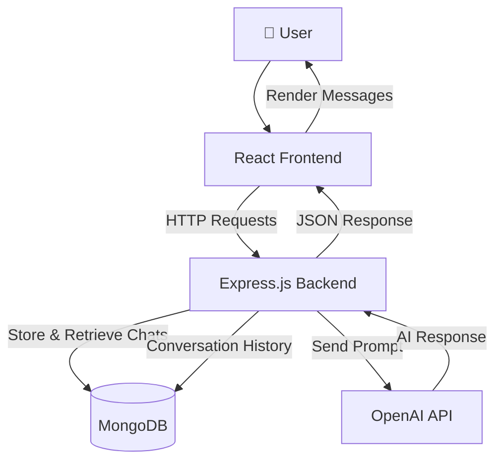
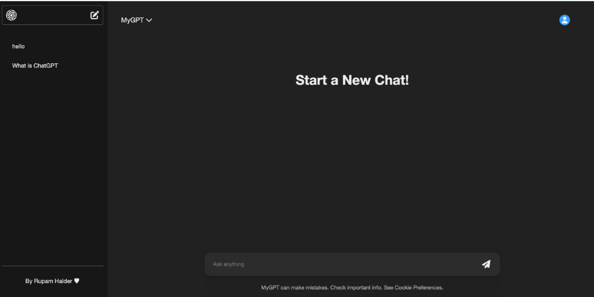

## MyGPT - ChatGPT Replica
---

A full-stack AI chat application inspired by ChatGPT, built using React.js, Node.js, Express.js, MongoDB, and OpenAI API. Deployed on Netlify.

---
## Features

- AI-powered chat using OpenAI API
- Persistent chat history with MongoDB
- Create and manage conversation threads
- Context-aware responses
- Real-time message updates
- Frontend built with React + Vite
- RESTful API backend using Express.js

---

##  Project Structure

```text
MyGPT/
│
├── Backend/
│   ├── models/
│   │   └── Thread.js
│   │
│   ├── routes/
│   │   └── chat.js
│   │
│   ├── utils/
│   │   └── openai.js
│   │
│   ├── .env
│   ├── package.json
│   ├── package-lock.json
│   └── server.js
│
├── Frontend/
│   ├── public/
│   │
│   ├── src/
│   │   ├── assets/
│   │   │
│   │   ├── App.css
│   │   ├── App.jsx
│   │   ├── Chat.css
│   │   ├── Chat.jsx
│   │   ├── ChatWindow.css
│   │   ├── ChatWindow.jsx
│   │   ├── Sidebar.css
│   │   ├── Sidebar.jsx
│   │   ├── MyContext.jsx
│   │   ├── index.css
│   │   └── main.jsx
│   │
│   ├── .gitignore
│   ├── eslint.config.js
│   ├── index.html
│   ├── package.json
│   ├── package-lock.json
│   └── vite.config.js
│
└── README.md
```

---
##  System Architecture



---

## Screenshots 



---

## Tech Stack

### Frontend
- React.js
- Vite
- Context API
- CSS3

### Backend
- Node.js
- Express.js
- MongoDB
- Mongoose
- OpenAI API

### Tools
- Git & GitHub
- Postman
- VS Code

---
## Author
Rupam Haldar